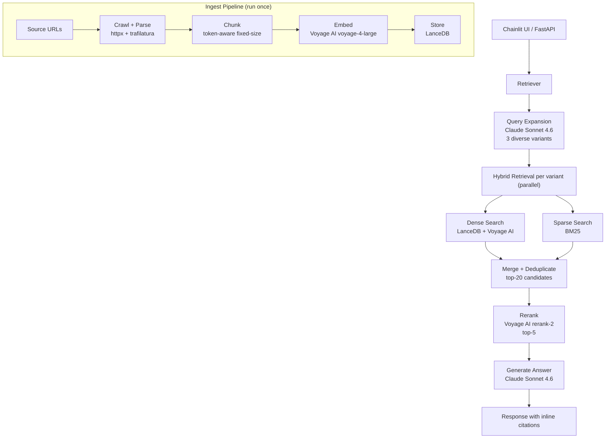

# Compass

**Compass** answers questions about AI engineering best practices using documentation from Anthropic, OpenAI, and practitioner blogs. The goal wasn't to build another RAG demo — it was to understand what actually moves retrieval quality and prove it with evals.

Built to demonstrate honest engineering: hybrid retrieval, reranking, query expansion, and a hand-crafted eval suite that measures what matters.  

## Eval Results

| Baseline | Hit Rate | MRR |
| --- | --- | --- |
| Baseline (hybrid only) | 0.65 | 0.41 |
| + Reranking | 0.62 | 0.54 |
| + Query expansion | 0.70 | 0.59 |
| + Semantic chunking | 0.33 | 0.25 |
| + Reverted to fixed-size | 0.70 | 0.64 |
| + Voyage embeddings + reranking | 0.88 | 0.81 |

## Architecture



| Component | Choice | Why |
| --- | --- | --- |
| Embeddings | Voyage AI (voyage-4-large) | Clean API, batching support; sentence-transformers was bulky and added latency |
| Vector store | LanceDB | Simple local file-based storage; would evaluate Pinecone or pgvector for prod where DB needs to be decoupled from the app |
| Reranker | Voyage AI (rerank-2) | Started with Cohere, hit rate limits; switched to Voyage since already using it for embeddings — one less dependency |
| LLM | Claude Sonnet 4.6 (Anthropic) | Strong instruction following, easy API integration, existing credits; architecture is model-agnostic so swapping is straightforward |

## Key Findings

### Reranking

Reranking improved MRR from 0.41 to 0.54 (+30%) while hit rate stayed relatively flat (0.65 → 0.62). This makes sense — reranking can't surface documents outside the initial retrieval pool, so recall is bounded by what hybrid search already found. What it does well is ordering: the cross-encoder (Voyage rerank-2) encodes the query and each candidate document jointly, giving it a richer relevance signal than the bi-encoder used in dense retrieval. The result is better ranked results within the same candidate set.

### Query Expansion

Query Expansion improved hit rate from 0.62 to 0.70 and MRR from 0.54 to 0.59. A single query is a single point in embedding space — relevant chunks may be spread across a neighborhood around that point. By generating 3 diverse variants with an LLM, retrieval casts a wider net, increasing the probability that at least one variant lands close to each relevant chunk. The key is diversity — paraphrases cluster in the same region and add little; variants that approach the question from different angles cover more ground.

### Semantic Chunking

Semantic Chunking was the most surprising finding — hit rate dropped from 0.70 to 0.33 after switching from fixed-size chunks. The intuition was "smarter chunking = better retrieval." The reality: larger, semantically coherent chunks produce diffuse embeddings that represent multiple topics at once. A blurred vector doesn't match any single query precisely. Fixed-size chunks at ~1,000 tokens stay focused enough to produce sharp embeddings. Reverted immediately after measuring.

## Eval Methodology

40 questions hand-crafted. LLM-generated questions tend to mirror the phrasing of source documents, which inflates retrieval scores without testing real retrieval difficulty.

What was measured:

- **Hit@k / MRR** — did the right chunk land in the top-k results?
- **Faithfulness** — is the answer grounded in the retrieved context? (question-level, LLM-as-judge)
- **Citation accuracy** — does each inline citation actually support the adjacent claim? (citation-level, stricter than faithfulness)
- **Refusal correctness** — does the system correctly refuse when the corpus doesn't have the answer?

Key insight: question-level faithfulness scored 95% (38/40). Citation-level accuracy scored 53%. The gap reveals a subtle failure mode — the answer as a whole can be grounded while individual citations point to loosely related chunks rather than directly supporting claims. Question-level evals alone would have hidden this entirely.

Judge model: Claude Sonnet 4.6 — same family as the generation model, so self-preference bias is a known caveat.

## What I'd Do Differently

- Diversify the corpus — 36 of 40 eval questions map to Anthropic docs, which skews both retrieval and evals. A balanced corpus across Anthropic, OpenAI, and practitioner blogs would give a more honest picture of system performance.
- Start with Voyage AI embeddings from day one — switching from sentence-transformers to Voyage late in the project was the single biggest retrieval improvement (0.70 → 0.88 hit rate). The local model added bulk and latency with no quality benefit. Start with the API.
- User-driven ingestion — let users bring their own URLs or documents into the system. The current corpus is static; a real assistant should be able to ingest new sources on demand.
- Design the eval dataset alongside the corpus — source distribution in evals should mirror corpus distribution from the start, not be corrected after the fact.

## How to Run

### Prerequisites

- Python 3.11+
- [uv](https://github.com/astral-sh/uv) package manager
- API keys: `ANTHROPIC_API_KEY`, `VOYAGE_API_KEY`

### Local

```bash
# Install dependencies
uv sync

# Run the ingestion pipeline (first time only)
uv run python -m compass.ingest.pipeline

# Start the Chainlit UI
uv run chainlit run src/compass/ui/app.py --port 8000
```

### Docker

``` bash
# Build the image
docker build -t compass .

# Run with your .env file and persisted LanceDB data
docker run -p 8000:8000 \
  --env-file .env \
  -v $(pwd)/data:/app/data \
  compass
```
